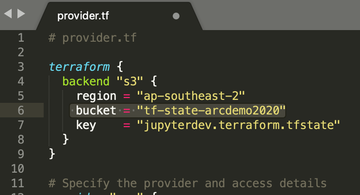
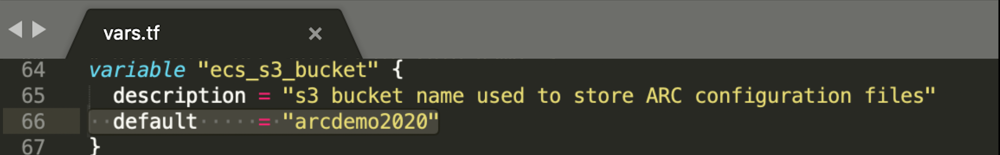
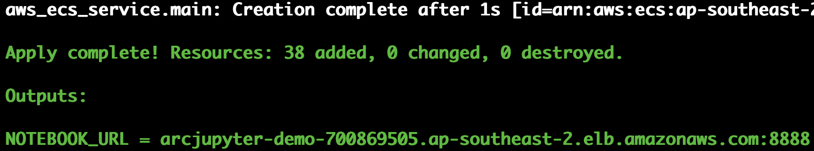

# Terraform Module 1: ARC\_Jupyter\_Notebook

This deployment helps you to spin up a long-running container via AWS Fargate in Amazon ECS. ARC Jupyter Notebook fits in the use case. 

## The Terraform module creates 

| Resource | Description | Comment | Ref_file|
|----------|-------------|:---------:|:-----:|
| VPC & networking |network resources that will be used by ARC|CIDR is hardcoded. please change it based on your use case| network.tf|
| VPC Endpoint| private connectivity between AWS services, such as `ECS to s3` or `ECR to ECS` | an extra data security over internet| network.tf|
| Application Load Balancer| using ALB to forward traffic to ARC jupyter container |provides an extra data security over network|alb.tf|
| ECS service | host one or multiple ARC jupyter containers with isolated compute, data access control. |ECS service is a logic group of long running tasks of the same Jupyter Notebook Task Definition.| ecs.tf|
| ECS task definition |Two task definitions are created: `arc-jupyter and arc-etl`| contains docker related information,such as network, compute,security and docker imanges etc.| templates/ecs/arc_app_iam.json.tpl templates/ecs/arc_etl_iam.json.tpl |


## Steps to run

### 1.Update backend s3 bucket name [Optional]

Ignore this step if you skip the [base infrustructure setup](./base/README.md). Open the file `provider.tf`, uncomment the following block and update the `bucket` to the one created by your base infrastructure deployment.



### 2. Update ecs\_s3\_bucket parameter 

Go to the `vars.tf` file, change `ecs_s3_bucket` to an existing bucket to store ARC configuration files



### 3. Deploy
```
# Sets up Terraform to run
$ terraform init

# Executes the Terraform run
$ ./run.sh
```

## Outputs




| Name | Description |
|------|-------------|
| NOTEBOOK_URL | A web link to a jupyter notebook instance. Copy and paste to your web browser. If you have 503 error, it means it is still deploying. Just wait for few more minutes. |

