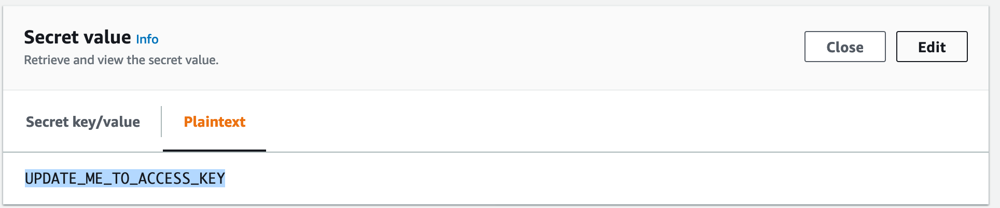
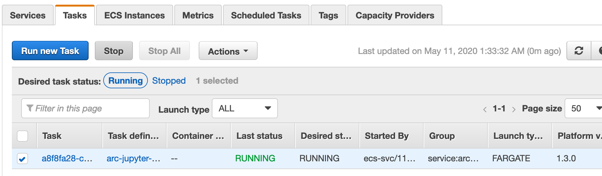

# Terraform Module 1: ARC\_Jupyter\_Notebook

This deployment helps you to spin up a long-running container via AWS Fargate in Amazon ECS. ARC Jupyter Notebook fits in the use case. 

## The Terraform module creates 

| Resource | Description | Comment | Ref_file|
|----------|-------------|:---------:|:-----:|
| VPC & networking |network resources that will be used by ARC|CIDR is hardcoded. please change it based on your use case| network.tf|
| VPC Endpoint| private connectivity between AWS services, such as `ECS to s3` or `ECR to ECS` | an extra data security over internet| network.tf|
| Application Load Balancer| using ALB to forward traffic to ARC jupyter container |provides an extra data security over network|alb.tf|
| ECS service | host one or multiple ARC jupyter containers with isolated compute, data access control. |ECS service is a logic group of long running tasks of the same Jupyter Notebook Task Definition.| ecs.tf|
| ECS task definition |Two task definitions are created: `arc-jupyter and arc-etl`| contains docker related information,such as network, compute,security and docker imanges etc.| templates/ecs/arc\_app.json.tpl templates/ecs/arc\_etl.json.tpl |


## Steps to run

### 1.Update backend s3 bucket name [Optional]

Ignore this step if you have skipped the [base infrustructure setup](../0-base/README.md) previously. 

Otherwise, open the file `provider.tf`, uncomment the following block and update the `bucket` to the new one created by your base infrastructure deployment.


### 2. Update ecs\_s3\_bucket parameter 

Go to the `vars.tf` file, change `ecs_s3_bucket` to an existing bucket in your AWS account, to store ARC  configure files and notebooks.


### 3. Deploy

Sets up Terraform to run

```
$ terraform init
```
Spin up a Fargate instance with 8GB memory and 1vCPU.
Jupyter need 4GB at least, adjust the config and task definition template if needed. 

```
$ terraform apply -auto-approve -var="fargate_memory=8192" -var="fargate_cpu=1024" 
```

### 4. Upload an example notebook

Copy and paste the NOTEBOOK_URL into your web browser, then click `Upload` button. Locate the repository folder on your computer, the sample notebook is stored in 

```
deploy/aws-fargate-single/appcode/job/nyctaxi_inlineSQL_demo.ipynb
```


### 5. OPTIONAL

If you'd like to try out the Athena `JDBCExecute` block as the last step, go to Secrets Manager on AWS console, then correct Athena credential with your own AWS access key associated to an IAM user.


Finally, stop the running Jupyter task in ECS, not service, to refresh the access key pair. You should be able to run the `JDBCExecute` blocks, once the new jupyter notebook is back online.



## Outputs


| Name | Description |
|------|-------------|
| NOTEBOOK_URL | A web link to a jupyter notebook instance. Copy and paste to your web browser. If you have 503 error, it means it is still deploying. Just wait for few more minutes. |


