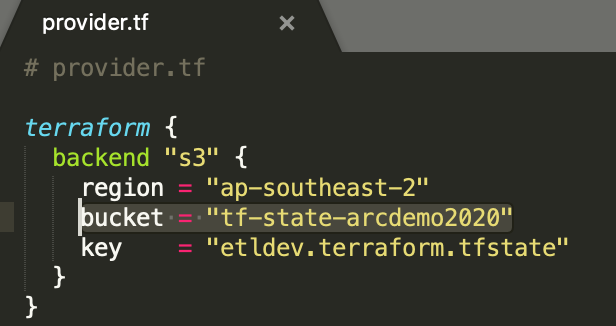

# Terraform Module 2: ARC\_Job\_Trigger


## Overview

A terraform lambda module to fire up an ECS Task, triggered by a file arrival event in S3 bucket. Our batch ETL processes don't need long running containers, instead terminate the task once job is done.

<details><summary>ECS Task vs ECS Service</summary>
<p>

```
> Amazon ECS Task is a running container with docker information defined in a Task Definition. It will be terminated, once the container is ended. 
> Amazon ECS Service represents a set of long running ECS Tasks based on the same Task Definition.
```

</p>
</details>


## Steps to deploy
### 1.Update backend s3 bucket name [Optional]

Ignore this step if you have skipped the [base infrustructure setup](../base/README.md) previously. 

Open the file `provider.tf`, uncomment the following block and update the `bucket` to the one created by your base infrastructure deployment.



### 2. Run the command
```
# Sets up Terraform to run
$ terraform init

# Executes the Terraform run
$ terraform apply
```

## Variables


| Name | Description | Type | Default | Required |
|:-----:|-------------|:----:|:-----:|:-----:|
| region | The region where you want to deploy the application| string | `ap-southeast-2` | yes |
| filterprefix | Lambda function invoke prefix for S3 Object Create or put | string | `appcode/job` | yes |
| filtersuffix | A file extension name as a Lambda function invoke suffix | string | `ipynb`| yes |
| lambda\_source\_package | compressed Lambda function source file name | string | `lambda_func.js.zip` | yes |
| s3\_bucket\_name | S3 bucket name where you want to create notification event | string | `arcdemo2020` | yes |
| ecs\_cluster\_name | ECS cluster name that hosts the ARC ETL task | string | `arc-cluster` | yes |
| ecs\_container\_name | Container name in an ECS task | string | `arc-etl` | yes |
| is_stream | indicator of streaming or batch data process | string | `false` | yes |

## Outputs


| Name | Description |
|------|-------------|
| lambda\_function\_name | Lambda Function name |
| lambda\_role\_name |The name of an IAM role created for the Lambda Function access |

