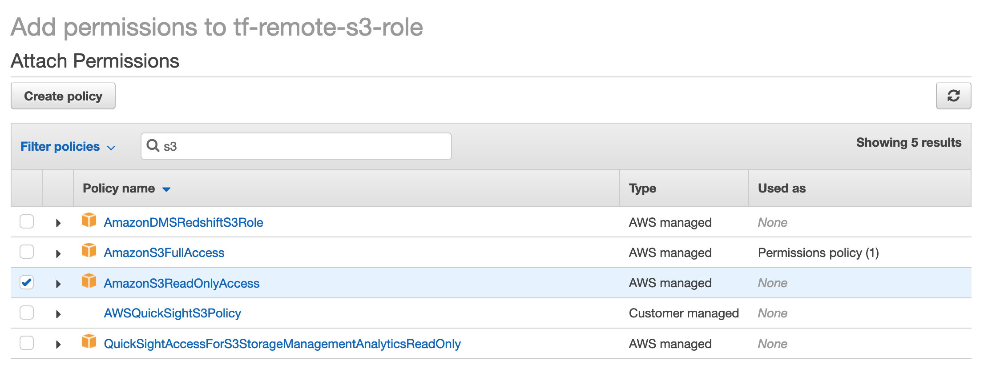

# Base Terraform

Creates the foundational infrastructure for the application's infrastructure.
These Terraform files will create a [remote state][state] and a [registry][ecr].
Most other infrastructure pieces will be created within the `environments` directory.


## Included Files

+ `main.tf`  
The main entry point for the Terraform run.

+ `variables.tf`  
Common variables to use in various Terraform files.

+ `state.tf`  
Generate a [remote state][state] bucket in S3 for use with later Terraform runs.

+ `ecr.tf`  
Creates an AWS [Elastic Container Registry (ECR)][ecr] for the application.


## Usage

### 1. Create or find a read only IAM role can access s3 bucket



### 2. Run the command
```
# Get into base folder
$ cd base

# Sets up Terraform to run
$ terraform init

# Executes the Terraform run
$ terraform apply
```


## Variables

| Name | Description | Type | Default | Required |
|:-------:|-------------|:----:|:-----:|:-----:|
| app | Name of the application. This value should usually match the application tag below. | string | `arcdemo2020` | yes |
| aws_profile | The AWS profile to use, this would be the same value used in AWS_PROFILE. | string | `labtest`| yes |
| region | The AWS region to use for the bucket and registry| string | `ap-southeast-2` | yes |
| s3\_read\_role | An existing role that will have read access to S3 bucket, this can be setup manually with the AWS managed role policy `AmazonS3ReadOnlyAccess`  | string |  | yes |
| tags | A map of the tags to apply to various resources. The required tags are: <br>+ `application`, name of the app <br>+ `environment`, the environment being created <br>+ `team`, team responsible for the application <br>+ `contact-email`, contact email for the _team_ <br>+ `customer`, who the application was create for | map | `<map>` | yes |


## Outputs

| Name | Description |
|------|-------------|
| bucket | Returns the name of the S3 bucket that will be used in later Terraform files |
| docker_registry | Returns the name of the ECR registry, this will be used later in various scripts |


## Additional Information

+ [Terraform remote state][state]

+ [Terraform providers][provider]

+ [AWS ECR][ecr]


[state]: https://www.terraform.io/docs/state/remote.html
[provider]: https://www.terraform.io/docs/providers/
[ecr]: https://aws.amazon.com/ecr/
